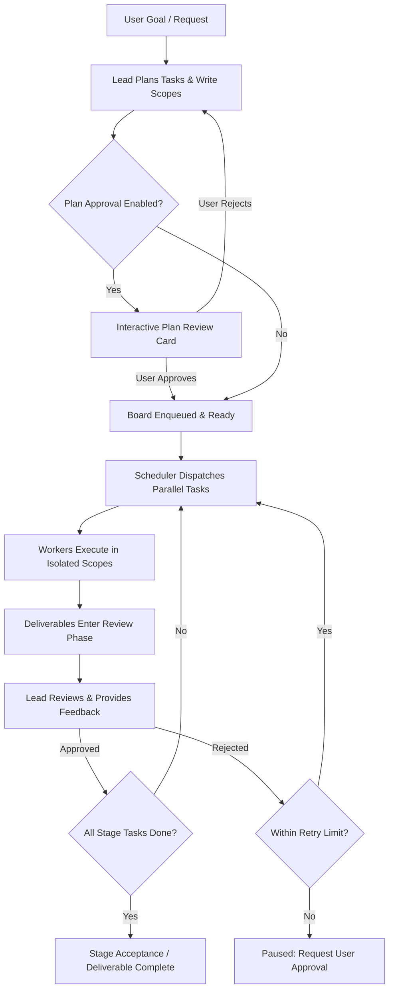

# dsh-boss-worker

[English](README.en.md) · [简体中文](README.md)

Multi-model hierarchical coordination plugin for DeepSeek Harness (DSH): **Architectural planning and review by the Lead, parallel execution by Worker models, closed-loop verification**.

> **Current Version**: `v0.1.0-beta.1` (Preview)
> Designed for complex scenarios such as large-scale refactoring, full-stack feature development, and multi-module auditing where multi-model teamwork is essential.

---

## 💡 Why the Boss-Worker Pattern?

When handling large, complex engineering tasks (e.g., full-stack software development, cross-module refactoring, deep codebase audits), single LLMs frequently face context-window blowout, overlapping file edit conflicts, and self-review blind spots. Furthermore, using a top-tier frontier model for every repetitive implementation step is prohibitively expensive, whereas relying solely on lightweight models compromises architectural soundness.

`dsh-boss-worker` brings the hierarchical **Lead-Worker Pattern** into DeepSeek Harness, **unlocking the full power of DSH's multi-provider and multi-API ecosystem**:
- **Lead / Boss Model (Architectural Brain)**: Powered directly by the primary conversation model in DSH. We recommend frontier reasoning models (such as **GPT-6.1 Sol** or **Claude Opus 5.5**) to manage high-level design, task decomposition, and code review. When **BOSS mode** is active, the lead is strictly prohibited from writing project implementation code directly, keeping its focus on architectural orchestration.
- **Worker Swarm (Implementation Team)**: Configurable across any API provider connected to DSH. You can pair specialized coding models (such as **DeepSeek-V4 Pro**) for implementation with ultra-fast models (such as **DeepSeek 4.1 Flash** or **Gemini Flash**) for test execution and static analysis.
- **Heterogeneous Synergy**: Combines the strategic intelligence of top-tier models with the high concurrency and cost-efficiency of specialized worker models—delivering both architectural excellence and fast, scalable execution while significantly cutting API expenses.
- **Rigorous Review Gate**: Finished worker deliverables transition to the `review` state. The lead must independently inspect diffs and test results against the acceptance criteria. Dependencies are unlocked only after approval; unaccepted tasks are sent back for rework with targeted feedback.
- **Autopilot Mode**: An end-to-end autonomous coordination loop where planning, parallel dispatch, independent review, and stage progression run continuously without repetitive manual prompts.

---

## ✨ Key Features

### 1. Heterogeneous Multi-Model Orchestration
- **Flexible Provider & Model Binding**: Seamlessly leverages all API providers configured in DSH. Every worker role (Coder, Tester, QA, etc.) can be bound to different providers and models independently.
- **Example Mix-and-Match Setup**:
  - **Lead / Reviewer**: `GPT-6.1 Sol` or `Claude Opus 5.5` (orchestration, interface design, code verification).
  - **Module Coders**: `DeepSeek-V4 Pro` (feature implementation, diff generation).
  - **QA & Verification**: `DeepSeek 4.1 Flash` (fast test suite execution, assertion checks).
- **On-the-Fly Dynamic Routing**: In addition to predefined team rosters, users can switch the assigned model for any pending task directly from the Web UI.

### 2. Strict Write Scope Isolation
Subtasks must declare their relative file or directory paths (`writeScopes`). The scheduler strictly ensures that **tasks with overlapping scopes run sequentially, while non-overlapping tasks execute in parallel**, completely preventing file edit collisions and merge overwrites across models.

### 3. Independent Quality Gate & Review
- No task is marked complete automatically. Deliverables enter the `review` phase upon subagent completion.
- The lead model uses `lead_worker_review` to evaluate deliverables against verified evidence and test outputs.
- Pass: Unblocks dependent tasks. Fail: Logs review feedback and routes the task for rework.

### 4. Bounded Rework Lifecycle
- Reworking a task within its approved scope preserves task-level consent and execution history, avoiding whole-board re-approvals.
- Governed by a retry cap (`maxRetries`). Once exhausted, the task pauses for user intervention to prevent runaway token expenditure. User authorization grants an extra attempt while retaining cumulative history.
- Expanding a task's write scope or altering critical dependencies automatically invalidates previous execution consent to keep operations safe.

### 5. Per-Task Dynamic Model Routing
- Switch execution models for specific tasks directly in the Web UI (e.g., assign reasoning models for architecture, coding specialists for implementation, lightweight models for test execution).
- Specialized routes are private to the current conversation and task, preventing pollution of the shared member pool or interference with other boards.

### 6. Draining, Checkpoints & Reliable Recovery
- Supports board pause, interruption, graceful draining, and checkpoint archival.
- Prior to shutdown, active worker executions drain cleanly, and disk state consistency is verified before safe termination is declared.
- Preserves full execution state across DSH host restarts without clearing tasks or generating stale writes.

### 7. Seamless DSH Web UI Integration
- **Dual Capsule Toggles**: Native `👔 BOSS Mode` and `🚀 Autopilot` toggles embedded directly in the conversation input bar.
- **Three-Cell Floating Monitor**: At-a-glance real-time counters for `[Running · Blue]`, `[Review · Gold]`, and `[Pending · Purple]` tasks.
- **Interactive Board & Task Cards**: Inspect task dependencies, assignees, and criteria; reassign models, dispatch tasks manually, or trigger isolated retries with one click.

---

## 🔄 Modes & Workflows

### Mode Configuration

| Switch / Setting | Scope | Description |
|---|---|---|
| **Shared Plugin Config** | Global | Team member roster, concurrency ceiling (`maxParallel`), retry cap (`maxRetries`), assignment strategy (`mixed/auto/manual`). |
| **👔 BOSS Direct** | Session-private | Prohibits the lead from directly calling implementation tools in the conversation; forces task decomposition and worker delegation. |
| **🚀 Autopilot** | Session-private | Fully autonomous execution loop. Automatically enqueues plans, dispatches tasks, reviews deliverables, and advances phases. |

> **Note**: Both BOSS Direct and Autopilot switches are scoped and persisted per conversation to prevent interference between parallel projects.

---

### Workflow A: Human-in-the-Loop Mode



1. The lead calls `lead_worker_plan` to outline self-contained tasks.
2. The user reviews task boundaries and assignments in the conversation card.
3. The scheduler triggers eligible tasks within concurrency limits.
4. Finished tasks are verified by the lead; approval unblocks dependent tasks.

---

### Workflow B: Autopilot Mode

Turn on the **`🚀 Autopilot`** toggle in the input area:
1. **Automated Planning & Dispatch**: The lead decomposes tasks; initial ready tasks dispatch immediately in parallel.
2. **Autonomous Review Loop**: Worker completion triggers the lead review. Successful tasks unlock subsequent steps; failed tasks enter rework automatically within the retry budget.
3. **Continuous Phase Advancement**: Once all stage tasks are approved, a batch settlement notice prompts the lead to evaluate the overall goal and call `lead_worker_plan(append: true)` to schedule subsequent phases until project completion.

---

## 🛠️ Lead Tool Suite

The lead model orchestrates teamwork through the following DSH tools:

| Tool Name | Purpose |
|---|---|
| `lead_worker_status` | Returns a snapshot of the current board, task statuses, dependencies, and owners. |
| `lead_worker_plan` | Proposes or appends tasks (`append: true`), specifying instructions, criteria, owners, and write scopes. |
| `lead_worker_dispatch` | Triggers the scheduler to safely launch ready tasks without scope conflicts. |
| `lead_worker_review` | Performs independent review of worker deliverables (approve or reject with feedback). |
| `lead_worker_list_members` | Queries available team members, capabilities, assigned models, and current availability. |
| `lead_worker_approve` | Formally approves and activates a proposed plan during human-in-the-loop workflows. |
| `lead_worker_recovery` | Manages pause, resume, graceful draining, checkpoints, and post-failure recovery. |

---

## 📦 Installation & Setup

### Prerequisites
- [DeepSeek Harness (DSH)](https://github.com/deepseek-ai/deepseek-harness) runtime
- Node.js `>= 20.0.0`

### Registering with DSH

The plugin integrates into DSH via Cordis and mounts its UI components into the Web interface:

1. **Clone the Repository**:
   Clone into your DSH plugins directory or workspace:
   ```bash
   git clone https://github.com/kongbai9420/dsh-boss-worker.git
   ```

2. **Configure Cordis Patch (`cordis.patch.yml`)**:
   Add the plugin definition to your DSH configuration:
   ```yaml
   - insert:
       - id: lead-worker
         name: "dsh-boss-worker"
         config:
           defaultConfig:
             enabled: true
             mode: mixed
             maxParallel: 4
             maxRetries: 2
             confirmPlan: true
             askApprovalPrompt: true
             members:
               # Worker A: Implementation model with high coding throughput
               - id: worker-coder
                 name: "Sol (Developer)"
                 provider: "deepseek-official"
                 model: "deepseek-v4-pro"
                 role: "Implementation and code changes"
                 instructions: "Work strictly within your assigned writeScopes, implement features, and report test evidence."
                 enabled: true
                 readOnly: false
               # Worker B: Lightweight model for testing and verification
               - id: worker-qa
                 name: "QA (Verification)"
                 provider: "deepseek-official"
                 model: "deepseek-flash"
                 role: "Testing and code review"
                 instructions: "Inspect diffs and run test suites; report objective verification results."
                 enabled: true
                 readOnly: true
   ```

   > **💡 Multi-Model Pairing Tips**:
   > - **Lead Model (Architect / Boss)**: Inherits the primary model of the current DSH conversation (e.g., select `GPT-6.1 Sol` or `Claude Opus 5.5` in DSH's model selector). It does not need to be declared in `members`.
   > - **Worker Models**: Bind freely to any Provider and Model supported by DSH (e.g., `deepseek-official / deepseek-v4-pro`, `deepseek-flash`, local models, etc.) in `members`. Mix and match for maximum cost-effectiveness and parallel execution speed.

3. **Persistence & Profile Support**:
   - The plugin automatically detects the active DSH profile directory and maintains isolated session configurations and board states per profile.
   - Includes CAS revision guards to avoid cross-tab configuration overwrites.

---

## 💻 Development & Testing

The project includes an extensive test suite covering core state machine logic, scheduling concurrency, API origin validation, and client UI simulation:

```bash
# Run core and scheduling test suites
npm test

# Run client bundle simulation tests
npm run test:client

# Validate package distribution and manifest files
npm pack --dry-run
```

Test coverage includes: board state machine transitions, concurrent write-scope collision prevention, rework consent preservation, retry budget protection, API origin safety, and UI status stream queueing.

---

## 🙏 Acknowledgements & References

The design and architecture of this project are deeply inspired by the following open-source projects:

- **[DeepSeek Harness (DSH)](https://github.com/deepseek-ai/deepseek-harness)**: Provides the robust runtime platform, subagent execution engine, and Web UI slot extension system.
- **[Cordis](https://github.com/cordisjs/cordis)**: Provides the elegant micro-kernel service architecture, context lifecycles, and dependency injection framework.
- **[ChatDev](https://github.com/OpenBMB/ChatDev) & [MetaGPT](https://github.com/geekan/MetaGPT)**: Foundational inspiration for multi-agent software engineering Standard Operating Procedures (SOP), role division, and dual review gates.
- **[Schemastery](https://github.com/cordisjs/schemastery)**: Modular, schema-driven validation and runtime configuration models.

---

## 📄 License

This project is licensed under the [MIT License](LICENSE). Contributions, forks, and feedback are welcome!
