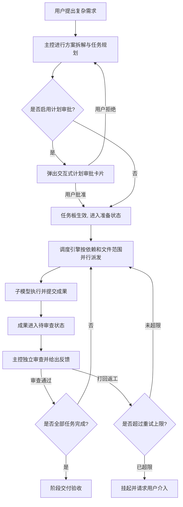

# dsh-boss-worker

[English](README.en.md) · [简体中文](README.md)

面向大型复杂工程项目的 DeepSeek Harness (DSH) 多模型主从协同插件：**主控架构统筹，子模型并行执行，闭环严苛验收**。

> **当前版本**：`v0.1.0-beta.1` (Preview)
> 专为大型重构、全栈开发、多模块审计等需要多模型高效配合的复杂场景打造。

---

## 💡 为什么需要 Boss-Worker 模式？

在面对复杂大型任务（如全栈系统开发、大型项目重构、深度代码审计）时，单个大语言模型常受限于上下文窗口膨胀、跨文件编辑易冲突、自写自检盲区等问题。此外，全流程使用单一顶尖大模型成本高昂，而全流程使用轻量模型又难以保证顶层架构质量。

`dsh-boss-worker` 为 DSH 引入了分层治理架构（Lead-Worker Pattern），**深度融合 DSH 的多 Provider / 多 API 接入能力**：
- **主控模型 (Lead / Boss · 架构大脑)**：由当前会话的主模型担任，推荐选用顶层推理、逻辑与架构设计能力最强的模型（例如 **GPT-6.1 Sol**、**Claude Opus 5.5** 等）。专注全局拆解、边界把控与严苛审查；在开启 **BOSS 模式** 时被强制禁止直接写业务代码，专注系统统筹。
- **子模型集群 (Workers · 执行团队)**：通过 DSH 接入的不同 API 渠道与模型，按工种自由搭配组合。例如配置高吞吐代码模型（如 **DeepSeek-V4 Pro**）专攻功能实现，搭配高速轻量模型（如 **DeepSeek 4.1 Flash**、**Gemini Flash**）负责测试用例运行与静态检查。
- **混合协作优势**：兼具顶尖大模型的“架构智慧”与轻量模型的“低成本、高并发执行力”，多模型各扬所长，在保障工程质量的同时大幅缩短响应时间并降低 API 开销。
- **真实验收闭环 (Review Gate)**：子模型交付成果后进入 `review` 状态，必须由主控逐项对照验收标准严格核验，通过后才解锁依赖；未通过则带着具体问题打回重做。
- **全自动托管 (Autopilot)**：从规划、调度执行、主控独立审查到推进下一阶段的全自主闭环流水线，大幅解放人工干预。

---

## ✨ 核心特性

### 1. 异构多模型混合编排 (Heterogeneous Multi-Model Orchestration)
- **自由绑定任意 Provider & Model**：完全继承 DSH 的多模型接入能力，团队中的每个角色（Coder、Tester、Reviewer 等）均可独立配置不同的 API 渠道与模型。
- **典型搭配示例**：
  - **主控决策**：`GPT-6.1 Sol` 或 `Claude Opus 5.5`（负责顶层规划、接口设计与代码审查）。
  - **模块编码**：`DeepSeek-V4 Pro`（负责文件实现、逻辑编码）。
  - **验证测试**：`DeepSeek 4.1 Flash`（负责用例执行、断言验证与语法分析）。
- **任务级动态换脑**：不仅预设团队成员可混搭模型，用户还可在 Web 界面随时针对特定的待执行任务临时更换专精模型，按需调遣。

### 2. 严格的文件写入范围隔离 (Write Scope Isolation)
子任务在规划时必须明确相对文件或目录路径 (`writeScopes`)。调度引擎严格确保**任何重叠写入范围的任务串行化，无交集任务安全并行**，从根源消除多模型并发编辑造成的文件覆盖和代码冲突。

### 3. 独立质量门禁与审查机制 (Quality Gate & Review)
- 子任务不设自动完成。模型交付后统一流转至 `review` 状态。
- 主控模型必须调用 `lead_worker_review`，依据明确的测试依据和代码产出进行独立判定。
- 验收通过：解锁依赖项；验收未通过：记录审查意见并流转至返工。

### 4. 权威可控的返工生命周期 (Authoritative & Bounded Rework Lifecycle)
- **精准返工预算反馈**：主控系统提示词实时注入当前会话设定的 `maxRetries`，且 `lead_worker_review` 审查工具在每次打回时返回权威的返工预算清单 (`reworkBudget`：已耗次数、设定上限、剩余额度及状态指引)，从根源上杜绝大模型依据历史对话或旧默认值在未达上限（如设定 10 次而在第 3 次）时误判停滞。
- **授权延续与超限保护**：同一任务在原范围内核准返工时保留任务级授权与历史记录；仅在真实达到上限 (`RETRY_LIMIT_REACHED`) 时挂起请求用户裁决。人工批准后追加单次执行机会，历史全量保留。
- **范围变更安全防护**：任务若擅自扩大写入范围或修改关键依赖，旧执行授权立即自动失效，确保项目文件安全。

### 5. 任务专属模型动态路由 (Per-Task Model Routing)
- 支持在 Web 界面为特定任务自由切换专精模型（例如架构用主力模型，写代码用精通编程的模型，测试验证用轻量高速模型）。
- 专属路由严格绑定当前会话与特定任务，自动过滤任务私有路由 (`task-route-*`)，与全局共享成员配置严格解耦，既不污染全局成员列表，也不会因更新全局设置而回滚运行中的子任务。

### 6. 完备的执行排空与断点恢复 (Draining & Recovery)
- 支持任务板暂停、中断、排空结算（Drain）与检查点（Checkpoint）保存。
- 停工或关机前，系统等待正在运行的子任务完整结算，核实磁盘一致性后方可标记安全状态。
- DSH 宿主重启后完整恢复现场状态，不丢失历史、不清空看板，杜绝陈旧执行覆盖。

### 7. 统一协作工作台与无缝 Web 交互 (Unified Floating Workspace)
- **一体化悬浮工作台**：整合原独立设置弹窗与监控悬浮球，支持在同一悬浮窗内无缝切换【任务看板】、【角色团队】与【主控设置】三栏。
- **直达子智能体会话 (↗ 查看当前任务对话)**：每个任务卡片与监控项均提供一键直达入口，通过 DSH 原生 `uiWorkspace` 注入服务精准打开本次执行对应的子智能体（Subagent）独立对话，无需在繁杂的历史会话列表中翻找。
- **自由拖拽与四周缩放**：支持全窗口无极拖拽定位，四周边缘及四角均可随意拉伸调节尺寸，并支持轻量折叠收起与独立隐藏。收起或隐藏纯属前端视图折叠，绝不影响后台任务执行。
- **右对齐固定保存**：角色与设置界面的保存按钮靠右固定于顶部，符合人机直觉手感，配置修改后随时一键生效。
- **双胶囊快捷开关**：在对话输入框右侧提供 `👔 BOSS 直派` 与 `🚀 全自动托管` 胶囊开关，实时切换会话协作模式。
- **非侵入式关闭恢复**：当关闭 BOSS 直派或全自动托管时，主模型完全恢复原生自主对话与直接编码能力，系统绝不干预或限制任何原生工具（包括原生 subagent、workflow、文件操作与终端命令）。

---

## 🔄 运行模式与工作流

### 模式配置说明

| 模式开关 | 作用域 | 说明 |
|---|---|---|
| **基本插件配置** | 全局共享 | 包括团队成员列表、并发上限 (`maxParallel`)、返工限制 (`maxRetries`)、模式 (`mixed/auto/manual`)。 |
| **👔 BOSS 直派 (Boss-Direct)** | 会话私有 | 限制当前会话的主控模型直接执行编码工具，强制其拆分子任务并派发执行。 |
| **🚀 全自动托管 (Autopilot)** | 会话私有 | 启用自动流水线。规划后自动派发，子任务交付后主控自动审查，全部完成后唤醒主控推进下一阶段。 |

> **提示**：为避免多会话互相影响，BOSS 直派与全自动托管开关均在每个会话中独立管理与持久化。

---

### 工作流 A：常规人机协同模式 (Human-in-the-Loop)



1. 主控调用 `lead_worker_plan` 规划阶段任务。
2. 用户在聊天界面确认任务清单与责任人。
3. 调度器在并发与文件范围约束下安全分发任务。
4. 子任务完成后，主控核验并通过，自动解锁后续后继任务。

---

### 工作流 B：全自动托管模式 (Autopilot)

开启输入栏的 **`🚀 全自动托管`** 胶囊开关：
1. **自动规划与派发**：主控拆解任务后自动激活入队，首批无依赖任务即刻并行启动。
2. **自动闭环审查**：子模型完成后触发主控审查，合格自动放行下阶段，不合格在预算内就地重试。
3. **阶段连续推进**：当前阶段任务全部通过后，主控模型被阶段结算事件唤醒，结合项目全局目标调用 `lead_worker_plan(append=true)` 追加后续阶段任务，直至整个工程验收完成。

---

## 🛠️ 主控工具集 (Lead Tools)

主控模型通过以下 DSH 工具驱动完整协作网络：

| 工具名称 | 职责说明 |
|---|---|
| `lead_worker_status` | 查看当前任务板快照，包括任务状态、责任人、依赖进展及整体状态。 |
| `lead_worker_plan` | 拆解并提交任务列表，支持增量追加 (`append: true`) 与多阶段推进。 |
| `lead_worker_dispatch` | 触发安全调度，调度器自动在并发容量与无写冲突约束下启动就绪任务。 |
| `lead_worker_review` | 主控对子模型提交的结果进行独立审查（达标通过 / 不达标返工并附具体意见）。 |
| `lead_worker_list_members` | 动态查询当前可用成员数量、特长、配置模型与忙闲状态。 |
| `lead_worker_approve` | 人机审批流中，接收用户授权后正式激活任务板。 |
| `lead_worker_recovery` | 控制暂停、恢复、安全排空结算、保存断点或在故障后核查恢复。 |

---

## 📦 安装与接入

### 前置要求
- [DeepSeek Harness (DSH)](https://github.com/deepseek-ai/deepseek-harness) 运行时环境
- Node.js `>= 20.0.0`

### 接入 DSH 插件体系

插件通过 Cordis 机制注入 DSH 宿主服务，并在 Web 前端自动注册监控组件：

1. **获取项目代码**：
   将本仓库克隆至 DSH 的插件管理目录或项目依赖中：
   ```bash
   git clone https://github.com/kongbai9420/dsh-boss-worker.git
   ```

2. **配置补丁声明 (`cordis.patch.yml`)**：
   在 DSH 配置文件中添加插件引入：
   ```yaml
   - insert:
       - id: lead-worker
         name: "dsh-boss-worker"
         config:
           defaultConfig:
             enabled: true
             mode: mixed
             maxParallel: 4
             maxRetries: 2
             confirmPlan: true
             askApprovalPrompt: true
             members:
               # 子角色 A: 负责写代码，可选用高性价比/高吞吐代码模型
               - id: worker-coder
                 name: "Sol (代码执行)"
                 provider: "deepseek-official"
                 model: "deepseek-v4-pro"
                 role: "负责代码编写、文件修改与逻辑实现"
                 instructions: "严格在任务范围内编写代码并自测，提交改动文件与证据。"
                 enabled: true
                 readOnly: false
               # 子角色 B: 负责单元测试与静态检查，可选用轻量高速模型
               - id: worker-qa
                 name: "QA (验证测试)"
                 provider: "deepseek-official"
                 model: "deepseek-flash"
                 role: "负责测试运行、质量把关与静态检查"
                 instructions: "只读审查，执行测试用例，提供真实测试依据。"
                 enabled: true
                 readOnly: true
   ```

   > **💡 异构模型自由搭配技巧**：
   > - **主控角色 (Lead / Boss)**：直接继承当前 DSH 会话的主模型（例如在界面顶部选择 `GPT-6.1 Sol`、`Claude Opus 5.5` 等推理大脑），无需在 members 中重复声明。
   > - **子执行角色 (Workers)**：在 `members` 列表中自由绑定 DSH 接入的任意 Provider 与 Model（如 `deepseek-official / deepseek-v4-pro`、`deepseek-flash` 等），各司其职，最大化发挥多 API 混合协作的性价比与并发吞吐。

3. **数据持久化与 Profile 支持**：
   - 插件自动探测宿主当前运行的 Profile 上下文，将配置与任务状态独立持久化在各自的 Profile 数据目录下。
   - 包含跨会话配置安全合并机制与版本 CAS 防并发覆盖保障。

---

## 💻 开发者与测试

项目包含完备的单元测试、调度隔离测试与前端模拟套件：

```bash
# 运行全量核心与调度测试
npm test

# 运行前端组件与状态流模拟测试
npm run test:client

# 验证发布包完整性与白名单过滤
npm pack --dry-run
```

测试体系包含 **284 项自动化测试** 与独立前端客户端模拟，全面覆盖：
- 任务生命周期与严格依赖拓扑调度
- 跨任务写入范围重叠冲突与无交集并行校验
- 精准返工额度注入与真实超限授权安全门禁
- 统一悬浮工作台内嵌切换、双向拖拽缩放与保存流
- 子智能体会话注入导航与原生受控服务解耦
- 关闭模式非侵入式放行与 DSH 原生工具零干扰保障
- 多 Profile 数据隔离持久化与配置版本 CAS 防并发覆盖

---

## 🙏 致谢与参考开源项目

本项目的设计与实现深受以下开源项目的启发，在此致敬与感谢：

- **[DeepSeek Harness (DSH)](https://github.com/deepseek-ai/deepseek-harness)**：提供了坚实的宿主底座、Subagent 执行系统与 Web 前端插槽扩展机制。
- **[Cordis](https://github.com/cordisjs/cordis)**：提供了优雅的微内核服务架构、上下文生命周期与插件依赖注入体系。
- **[ChatDev](https://github.com/OpenBMB/ChatDev) & [MetaGPT](https://github.com/geekan/MetaGPT)**：多智能体协作中软件工程标准作业程序（SOP）、分工角色化与主从质检机制的核心设计灵感来源。
- **[Schemastery](https://github.com/cordisjs/schemastery)**：模块化强类型 Schema 验证与运行时配置驱动规范。

---

## 📄 开源许可证

本项目基于 [MIT 许可证](LICENSE) 开源。欢迎自由使用、学习与贡献！
